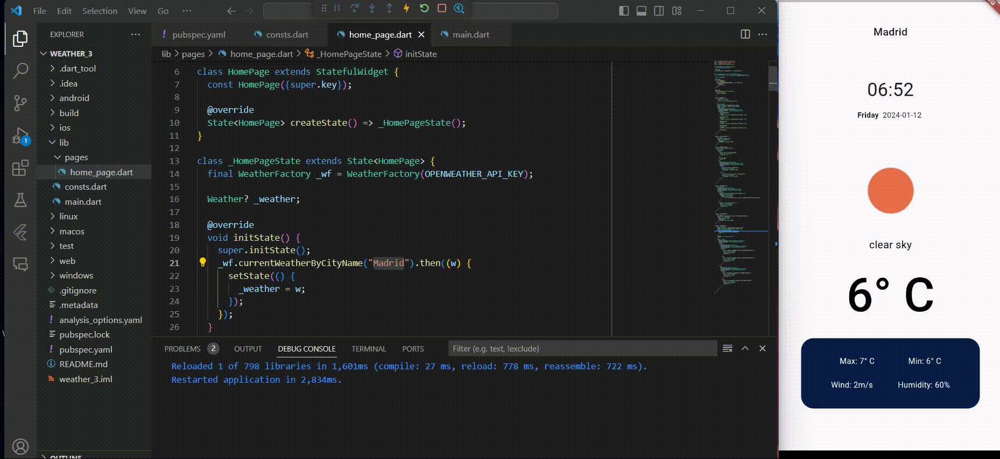

# Flutter Weather App

A simple weather app built with Flutter that fetches current weather information using the OpenWeatherMap API.

## Features

- Display current weather information for a specific city (Ex: Colombo).
- Show the location name, date, time, weather icon, temperature, and additional details.


## Preview




## Getting Started

### Prerequisites

- Flutter installed on your machine
- OpenWeatherMap API key

### Installation

1. Install dependencies:
    ```bash
   flutter pub get
   ```
    
2. Run App
    ```bash
   flutter run
   ```
<hr>
<div align="center">
  
    
</div>
<hr>
